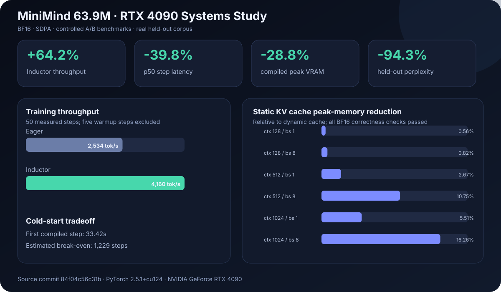

# MiniMind Systems — Measured LLM Training & Serving

[](https://github.com/Evihut/minimind-systems/actions/workflows/ci.yml)

A measured ML-systems extension of [jingyaogong/minimind](https://github.com/jingyaogong/minimind): static KV-cache management, reproducible CUDA experiments, and batched LLM serving in PyTorch.

This is not a from-scratch LLM framework. Upstream provides the Transformer and training foundations; this repository adds the cache implementation, experiment harness, serving stack, tests, and reproducible evidence. The latest controlled run used a 63.91M-parameter model on one RTX 4090. It evaluates systems behavior and a short real-corpus learning check—not the quality of a converged chat model.



## What this project adds

- Preallocated, reusable **Static KV Cache**, with logits/output equivalence and stable-buffer tests.
- A resumable, budget-capped GPU experiment suite with JSON manifests, input invalidation, Ctrl-C recovery, and strict correctness gates.
- Training and inference benchmarks with held-out perplexity, latency distributions, throughput, memory, and profiler operator tables.
- FastAPI chat-completions endpoint with request batching, queue limits, LRU model loading and Prometheus metrics.
- CPU tests, GitHub Actions workflow, Docker and Prometheus deployment recipes.

The base Dense/MoE Transformer, GQA, dynamic KV cache and training scripts come from MiniMind. Read [UPSTREAM.md](UPSTREAM.md) and [NOTICE](NOTICE) for the contribution boundary.

## Measured RTX 4090 results

Environment: one RTX 4090, PyTorch 2.5.1+cu124, BF16, SDPA, 63.91M parameters. Raw JSON, provenance, run metadata, and the generated report are versioned under [`artifacts/gpu/`](artifacts/gpu/).

| Experiment | Controlled comparison | Result |
|---|---|---|
| Training compile | eager vs TorchInductor | **+64.2%** steady-state tok/s, **-39.8%** p50 step time, **-28.8%** peak memory |
| Compile startup | first compiled step vs steady-state saving | 33.42s first step; estimated break-even at about **1,229 steps** |
| Static KV Cache | dynamic vs static, context 128–1024, batch 1/8 | up to **16.26%** lower peak memory; throughput ranged **-4.36% to +1.79%** |
| Real-corpus pipeline | held-out validation before/after 500 steps | loss 8.9248→6.0640; perplexity 7,515.8→430.1 |

The pipeline result proves the tokenizer → data → training → validation path learns from a disjoint real-text split. It does **not** claim a useful or converged language model. Static cache is presented as deterministic preallocation and memory control, not a universal latency win. See the [full GPU report](docs/GPU_RESULTS.md) and [experiment protocol](docs/EXPERIMENTS.md).

## Earlier CPU mechanism checks

Exploratory measurements on an Apple Silicon CPU with a **532,864-parameter** model:

| Experiment | Comparison | Observation |
|---|---|---|
| Cache decoding | static vs no cache | +74.10% tokens/s |
| Cache allocation change alone | static vs existing dynamic cache | +0.11% tokens/s; not evidence of a robust speedup |
| Batched serving | batch 8 / 2ms vs batch 1; 100 requests, concurrency 8 | +155.20% requests/s, -54.39% p95 latency |

These are short local mechanism checks, not statistical guarantees or model-quality claims. Cache benchmark latency sums timed model/decode steps; API latency is measured by the client. Server TTFT is an estimate of request-handler arrival to token computation, **not client-observed streaming TTFT**.

Reports: [inference](artifacts/inference_benchmark.json), [training](artifacts/training_benchmark.json), [serving comparison](artifacts/load_test_comparison_2ms.json). See [experiment notes](docs/EXPERIMENTS.md) and the [detailed Chinese overview](README_PORTFOLIO.md).

## Quick start

Use a Python 3.10+ virtual environment from the repository root:

```bash
python -m venv .venv
source .venv/bin/activate
python -m pip install -r requirements-dev.txt
python -m pytest -q
python -m portfolio.smoke_pipeline --device cpu --steps 5 --min-loss-reduction 0.1
```

Run benchmarks without overwriting the checked-in evidence:

```bash
python -m benchmarks.inference_benchmark --device cpu --profile --output /tmp/minimind-inference.json
python -m benchmarks.training_benchmark --device cpu --save-model artifacts/models/smoke --output /tmp/minimind-training.json
```

Regenerate the checked-in GPU report from raw artifacts:

```bash
make gpu-report
```

To run the resumable, budget-capped CUDA matrix on another machine, follow the [GPU runbook](docs/GPU_RUNBOOK.md).

The second command creates a tiny demo model locally; it is not a useful chat model. Weights and raw profiler traces are intentionally not committed.

Serve it:

```bash
MODEL_ROOT=artifacts/models DEVICE=cpu python -m serving.app --host 127.0.0.1 --port 8998
# In another terminal:
python tools/load_test.py --url http://127.0.0.1:8998/v1/chat/completions --model smoke --requests 100 --concurrency 8 --max-tokens 32 --output /tmp/minimind-load.json
```

API discovery: `/docs`, `/health`, `/ready`, `/v1/models`, `/metrics`. Keep the demo local; it has no production authentication or tenancy controls.

## Limitations and next steps

- SSE currently buffers completed output; true token streaming and continuous batching are future work.
- The 500-step corpus run validates the pipeline; it is not a convergence or downstream-quality study.
- DDP, CUDA Graphs, INT8/INT4, and repeated multi-seed performance trials remain unmeasured.
- Local `aot_eager` validation did not demonstrate acceleration; INT8 was skipped because the local quantization backend was unavailable.
- Docker Compose provides a GPU deployment recipe and expects local weights; only its configuration has been checked.
- Planned: true streaming, mixed-length GPU load tests, cancellation/backpressure coverage, and longer held-out training/evaluation.

## Documentation and attribution

- [Architecture](docs/ARCHITECTURE.md)
- [Experiments](docs/EXPERIMENTS.md)
- [RTX 4090 report](docs/GPU_RESULTS.md)
- [Resume and interview notes](docs/RESUME.md)
- [Upstream source and changes](UPSTREAM.md)
- [Archived upstream Chinese introduction](README_UPSTREAM.md) / [English introduction](README_en.md)

Licensed under [Apache-2.0](LICENSE). Upstream source, images and documentation remain credited to MiniMind and its contributors; they are not presented as independent personal achievements.
