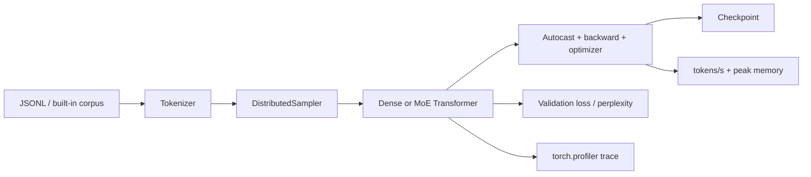
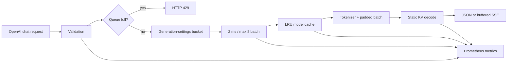

# 系统架构与设计决策

## 训练路径



`benchmarks/training_benchmark.py` 提供 smoke、25.76M 和 63.91M 三档配置。每个 rank 使用独立 `DistributedSampler`；CUDA 下采用 NCCL、CPU 下采用 Gloo。报告记录 world size、global batch、precision、loss curve、验证 PPL、吞吐和峰值内存，避免只展示一张无法复现的 loss 截图。

## Static KV Cache

动态缓存每步执行 `cat([past, current])`，缓存长度越长，累计复制和 allocator 开销越明显。`StaticKVCache` 为每层一次性分配 `[batch, kv_heads, max_length, head_dim]` 的 K/V buffer，prefill/decode 仅原位写入对应 slice。

```text
dynamic: K_1 → cat(K_1, K_2) → cat(K_1..2, K_3) → ...
static:  [________________ max_length ________________]
          ↑ write prefix         ↑ write next token
```

安全约束包括：仅限 inference、batch/head/head_dim 一致、写入不超过 capacity、所有层共享一致的 sequence position。`reset()` 只归零逻辑长度并复用已分配内存。

## 在线推理路径



### 动态批处理

请求只与完全相同的 `model / max_tokens / temperature / top_p` 合并，避免不同停止条件或采样分布互相污染。worker 在首请求到达后等待最多 2ms，或达到 batch 8 立即执行。队列上限提供背压；关闭服务时取消 worker 并清理待处理任务。

### 模型缓存

`AsyncModelCache` 使用锁保护 LRU 状态，同一模型的并发 cold start 共享一个 in-flight load future，避免重复占用显存。超过容量时淘汰最久未使用实例并允许 CUDA allocator 回收缓存。

### 可观测性

`/metrics` 暴露 request/error/in-progress、request latency、端到端 TTFT、generated tokens、queue depth/wait、batch size/latency 和 model-cache hit/miss/coalesced 指标。TTFT 从请求进入 handler 开始，包含排队、模型查找、分词与 backend 首次 forward；API 另行返回 backend-only TTFT。负载工具从客户端计算 req/s、token/s 和 p50/p95/p99，并汇总服务端 TTFT。

## 自动验证

1. 模型：Dense/MoE 形状与梯度、GQA/RoPE/MoE fail-fast、权重绑定。
2. Cache：full forward、dynamic cache、static cache 的 logits 与 greedy output 一致；buffer pointer 稳定。
3. 训练：scheduler、断点采样器、真实 tokenizer 的端到端反向传播。
4. 服务：并发请求合批、参数隔离、LRU/并发加载合并、Prometheus 指标、真实 batch backend 的 TTFT。
5. 交付：Ruff、21 项 pytest、CI smoke benchmark、Docker Compose 配置检查。

## 仍需 GPU 验证的边界

- 25.76M/63.91M 从零训练结果、C-Eval/C-MMLU/OpenBookQA 能力指标。
- CUDA BF16/FP16 的真实吞吐、峰值显存与 DDP scaling efficiency。
- TorchInductor 编译收益、graph break 原因和 CUDA Graph 兼容性。
- INT8/INT4 的效果—速度—显存 Pareto curve。
- 长上下文和大 batch 下 Static Cache 相对 dynamic cache 的收益。
